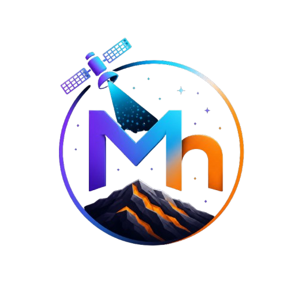

<div align="center">
  

  # MnSAT 🛰️
  **AI + Space Technology to Identify Manganese Reserves**

  <p align="center">
    
    
    
    
    
  </p>

  <p align="center">
    <em>A Smart India Hackathon (SIH) 2026 Project</em>
  </p>
</div>

---

## 🌍 Overview

**MnSAT** is a comprehensive platform that leverages **satellite remote sensing** and **deep learning** to revolutionize mineral exploration in India. By analyzing multispectral satellite imagery (Landsat, Sentinel-2, ISRO Resourcesat-2), our custom hybrid neural network architecture (**SpectralMnNet**) identifies unique absorption signatures of manganese deposits with high accuracy. 

This approach significantly reduces the time (from months to seconds) and cost (from lakhs per site to near-zero marginal cost) of traditional geological surveys.

---

## ✨ Key Features

- **Interactive 3D Globe**: Built with Three.js and React Three Fiber, featuring a continuously rotating Earth, animated satellite orbits, and glowing manganese reserve markers.
- **Deep Learning Pipeline (SpectralMnNet)**: A hybrid CNN + Vision Transformer architecture that captures both spectral signatures and spatial geological patterns.
- **Pan-India Dashboard**: Interactive map and dashboard to explore India's primary manganese-bearing geological formations (Odisha, Maharashtra, MP, Karnataka, Rajasthan, AP).
- **Real-Time Inference Interface**: Upload your own satellite imagery (`.tif`, `.geotiff`) to get pixel-level probability heatmaps of manganese presence.
- **Responsive Glassmorphism UI**: A premium, modern, dark-space themed UI built with Framer Motion, Next.js, and CSS modules.

---

## 🛠️ Technology Stack

### Frontend & UI
- **[Next.js 14](https://nextjs.org/)** (App Router)
- **[React](https://reactjs.org/)**
- **[Three.js](https://threejs.org/) & [React Three Fiber](https://docs.pmnd.rs/react-three-fiber)** (3D visualization)
- **[Framer Motion](https://www.framer.com/motion/) & [GSAP](https://gsap.com/)** (Animations)
- **[Leaflet](https://leafletjs.com/)** (Interactive Maps)

### Deep Learning & Data
- **[PyTorch](https://pytorch.org/)** (Model framework)
- **[Vision Transformers (ViT)](https://arxiv.org/abs/2010.11929)** + **ResNet-50**
- **[Kaggle GPUs](https://www.kaggle.com/)** (Model training)
- **Geospatial Tools**: Rasterio, GDAL, GeoPandas

### Backend
- **[FastAPI](https://fastapi.tiangolo.com/)** (High-performance inference API)
- **Python** (Data processing)

---

## 🧠 Model Architecture: SpectralMnNet

Our proprietary model processes satellite imagery through a robust 7-layer pipeline:
1. **Input**: Multi-spectral satellite patches (GeoTIFF)
2. **Spectral 1D Conv Branch**: Learns inter-band relationships specific to manganese absorption.
3. **Spatial CNN Backbone (ResNet-50)**: Extracts spatial geological patterns.
4. **Vision Transformer Encoder**: Captures long-range spatial dependencies of geological formations.
5. **Cross-Attention Fusion Module**: Fuses spectral ("what mineral") and spatial ("where") features.
6. **U-Net Decoder**: Upsamples fused features to generate a spatial probability map.
7. **Output**: Pixel-level probability heatmap (Focal + Dice Loss).

**Performance Targets**: ~95% Accuracy, High Precision & Recall for Manganese.

---

## 👥 The Team

Our passionate team brings together expertise across Data Science, Deep Learning, and Software Engineering:

| Name | Role | Focus |
|---|---|---|
| **Pranav Lamkhade** | Data Science Lead & Model Architect | SpectralMnNet architecture, deep learning pipeline |
| **Akash Barge** | Data Science & Data Pipeline | Satellite data acquisition (USGS/Copernicus), preprocessing |
| **Payal Bajantri** | Data Science & Evaluation | Model evaluation, metrics visualization, Kaggle notebooks |
| **Atharav Jagdhane** | Data Science & Backend | FastAPI backend, inference pipeline, geospatial services |
| **Shreya Babde** | Software & Frontend Lead | Next.js, 3D globe (Three.js), animations |
| **Prachi Dhere** | Software & UI/UX | Visual design system, responsive UI components |

---

## 🚀 Getting Started (Frontend)

To run the Next.js frontend locally:

1. **Clone the repository:**
   ```bash
   git clone https://github.com/pranav-6944/MnSAT.git
   cd MnSAT/frontend
   ```

2. **Install dependencies:**
   ```bash
   npm install
   ```

3. **Run the development server:**
   ```bash
   npm run dev
   ```

4. **Open in browser:**
   Navigate to [http://localhost:3000](http://localhost:3000)

---

## 📄 License

This project is licensed under the MIT License - see the [LICENSE](LICENSE) file for details.

---
<p align="center">
  <i>Built for Smart India Hackathon</i> 🚀
</p>
